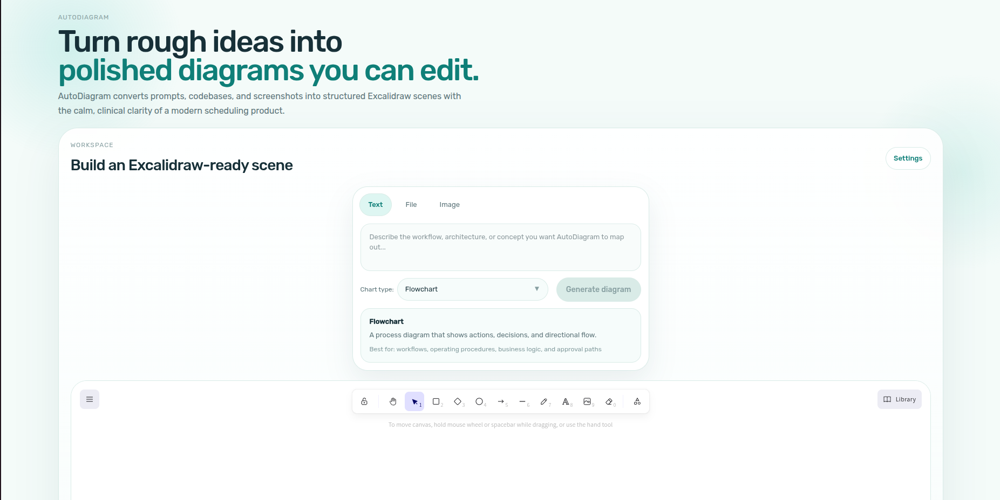
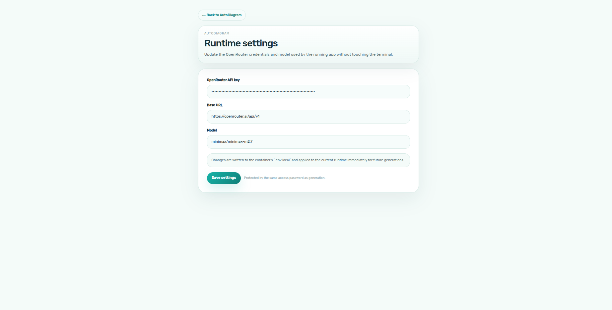

# AutoDiagram

AutoDiagram is a local-first app that turns text, code, and images into editable Excalidraw diagrams.

It uses an OpenRouter-compatible chat model to generate diagram JSON, then renders the result directly in Excalidraw so you can keep editing it by hand.

## Screenshots

### Main Workspace

Latest main workspace UI with the slimmer hero and diagram canvas directly below:



### Settings



## Features

- Prompt-to-diagram generation
- File-to-diagram generation for code and text inputs
- Image-to-diagram generation
- Editable Excalidraw output
- Runtime settings page for OpenRouter configuration
- Local Docker deploy script for rebuild/start/stop/restart/delete flows

## Stack

- Next.js 16
- React 19
- Excalidraw
- OpenRouter-compatible chat API

## Requirements

- Node.js 22+
- pnpm 9+

## Environment

Create `.env.local` from `.env.example` and set:

```env
NEXT_TELEMETRY_DISABLED=1
SERVER_LLM_API_KEY=your_openrouter_key_here
SERVER_LLM_BASE_URL=https://openrouter.ai/api/v1
SERVER_LLM_TYPE=openrouter
SERVER_LLM_MODEL=your_model_here
```

Notes:

- `SERVER_LLM_TYPE` should remain `openrouter`.
- This app is configured for local/private use. It does not ship an app-level access-password layer.
- `NEXT_TELEMETRY_DISABLED=1` keeps Next.js telemetry off for local/private use.

## Local Development

```bash
pnpm install
pnpm dev
```

Open `http://localhost:3000`.

## Deploy Script

This repo includes `drawnctl.sh` for local container management.

Typical flow:

```bash
bash drawnctl.sh init
bash drawnctl.sh deploy
```

Other commands:

```bash
bash drawnctl.sh start
bash drawnctl.sh stop
bash drawnctl.sh restart
bash drawnctl.sh delete
bash drawnctl.sh status
```

Notes:

- `init` creates or updates `.env.local`
- `deploy` rebuilds the image and replaces the running container
- the Docker deploy binds to `127.0.0.1` and runs on `http://localhost:3000` by default

## Settings Page

Open `http://localhost:3000/settings` to update:

- OpenRouter API key
- OpenRouter base URL
- model name

The settings page writes the values into `.env.local` and updates the current runtime immediately. When deployed with `drawnctl.sh`, that same file is mounted into the container and reused on restart or redeploy.

## License

MIT
